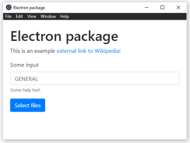

# Electron starter with python scripting and installer
Based on https://github.com/electron/electron-quick-start. Tested on Windows 10. Template is suited for batch-processing of files using a python script. This allows to send someone a windows installer that contains environment with dependencies such as opencv or machine learning libraries that would be othervise hard to install for a common user.



## Features
- bootstrap CSS
- python scripting with pyinstaller
- windows installer

## Main template program loop
Relevant code is in [preload.js](./preload.js) and [python/script.py](./python/script.py).

1. select multiple files using button
2. for each file, python script will be called
3. results from python script will be discarded except the last which is returned
4. result is printed to browser console using `console.log` (Open developer tools using `Cltr+Shift+I`)

## Developer pre-requisities
- nodejs https://nodejs.org/en/
- miniconda for python package management https://docs.conda.io/en/latest/miniconda.html
- Wix-toolset (its binaries on path, by default: `C:\Program Files (x86)\WiX Toolset v3.11\bin`)

## Project setup
1. change settings at [build_installer.js](./build_installer.js)
2. install node dependencies `npm install`
3. create miniconda environment named `electron`:
    ```
    conda create -n electron python=3.7 unidecode
    ```
4. run `npm run pyinstaller`. Currently there is no support for "dev server" for python. You need to run this command every time you change the python script.

## Start development version
```
npm start
```

## Build with installer
```
npm run clean && npm run pyinstaller && npm run package && npm run installer
```

## Related links
- on creating windows installer https://ourcodeworld.com/articles/read/927/how-to-create-a-msi-installer-in-windows-for-an-electron-framework-application
